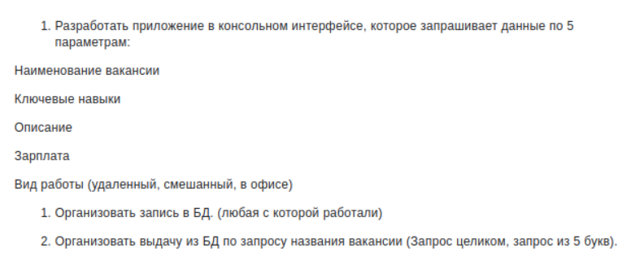
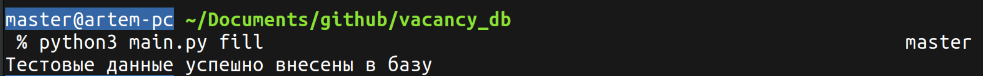
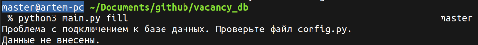
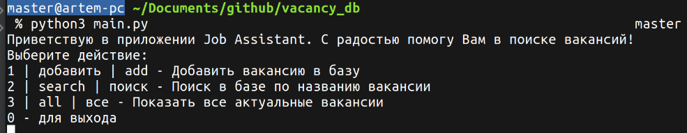
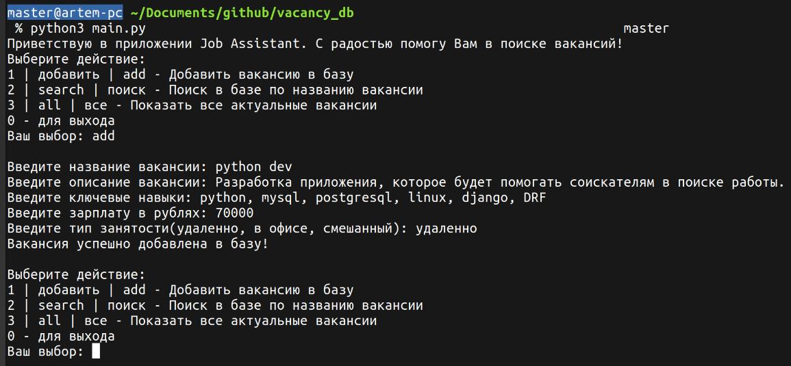
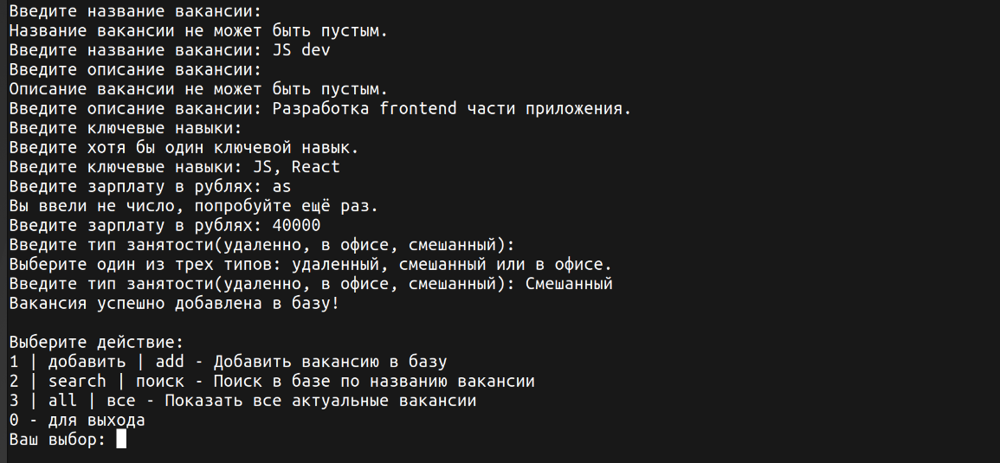
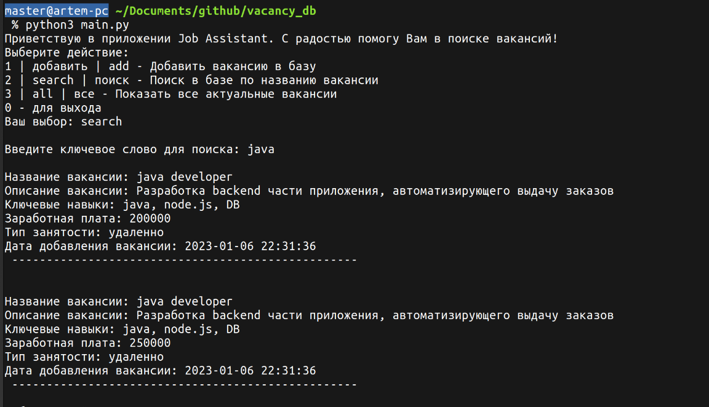
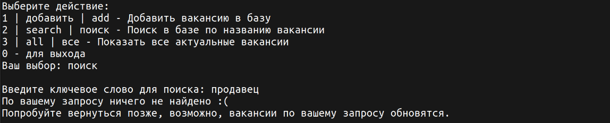
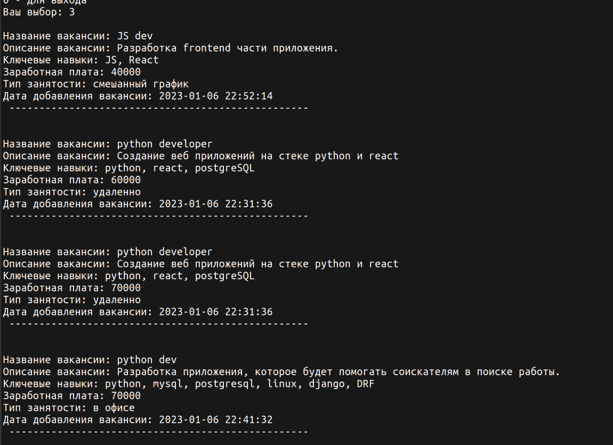

# Job Assistant. 
## Консольное приложение для работы с базой данных.
Тестовое задача для участия в проекте.
Описание задания:



Стэк:
- Python 3.11
- SQLAlchemy
- MySQL Ver 8.0.31

### Для запуска проекта необходимо:
- Сделать форк репозитория
- Клонировать на локальный компьютер
- Создать виртуальное окружение
```python3 -m venv env```
- Перенести зависимости из requirements.txt ```pip3 freeze -r requirements.txt``` 
- Зайти в файл config.py и проверить настройки: 
    - ```db_type = mysql``` - тип базы данных. Для тестового запуска можно поставить sqlite.
    - ```driver = pymysql``` - драйвер для работы с базой данных. Для sqlite можно оставить пустым.
    - ```db_name = vacancy_db``` - название базы данных.
    - ```host = localhost``` - хост. Для работы с sqlite можно оставить пустым.
    - ```user = your_username``` - имя пользователя для подключения к БД. Для работы с sqlite можно оставить пустым.
    - ```password = your_password``` - пароль для подклчюения к БД. Для работы с sqlite можно оставить пустым.
    - ```port = ''``` - порт для подключения. При работе локально нужно оставить пустым.
    - ```DEBUG = False``` - режим отладки. При необходимости отображать запросы к базе - поставить ```True```
- Заполнить базу тестовыми данными, для этого в корне проекта ```python3 main.py fill```
- Запустить приложение - ```python3 main.py```


## Описание файлов
1) **config.py** - конфигурационый файл с настройками.
2) **db_setup.py** - файл, отвечающий за работу с базой данных. 
3) **validators.py** - файл со всеми валидаторами.
4) **main.py** - точка входа в приложение - он же основной файл, отвечающий за получение данных от пользователя.


## Примеры работы приложения
```python3 main.py fill```
- Пример удачного внесения тестовых данных

- Пример неудачного внесения тестовых данных


```python3 main.py```
- Запуск приложения
  
- Добавить вакансию
  
- Добавить вакансию (валидация)
  
- Успешный поиск по вакансиям
  
- Поиск без результата
  
- Показать все актуальные вакансии
  

